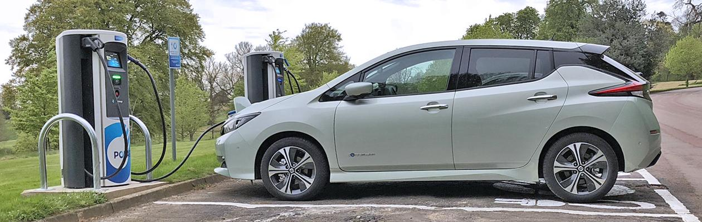

# EV-Charging

From [Zap-map](https://www.zap-map.com/)
## Background
The demand for electric cars has grown exponentially in recent years, with rising environmental pressure, economic incentives and advancements in battery technology driving the transition away from traditional petrol and diesel engines. In January 2023, one out of every five new cars registered in the UK was either a plug-in hybrid vehicle (PHEV) or battery electric vehicle (BEV), representing a significant increase from the previous year. Despite this surge in the number of electric vehicles on the road, there remains a question as to whether the deployment of supporting charging infrastructure is keeping pace with the demand.

The 2021 Competition and Markets Authority (CMA) report highlights the need for charging infrastructure to increase by at least tenfold by 2030. The report also notes the potential risk of "charging deserts" in certain areas across the UK, which makes it evident that the current infrastructure will not be sufficient in the near future. Given this information, it is important to evaluate the effectiveness of the strategy that has been employed until now in deciding the location of charging points. Through this project I aimed to assess the current placement of charging points and determine whether their installation is aligned with areas of high traffic density, where it can be assumed that demand is at its highest.

