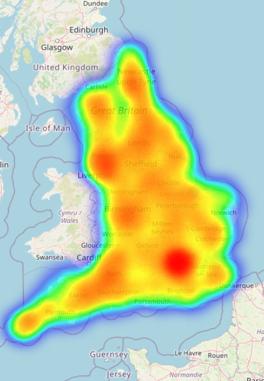

# EV-Charging

From [Zap-map](https://www.zap-map.com/)

This project was completed as part of the General Assembly immersive data science course.

## Table of Contents
[Background](#Background)  
[Goals of the Project](#Goals-of-the-Project)  
[Data Collection](#Data-Collection)

## Background
Background
The demand for electric cars has grown exponentially in recent years, with rising environmental pressure, economic incentives and advancements in battery technology driving the transition away from traditional petrol and diesel engines. In January 2023, one out of every five new cars registered in the UK was either a plug-in hybrid vehicle (PHEV) or battery electric vehicle (BEV), representing a significant increase from the previous year. Despite this surge in the number of electric vehicles on the road, there remains a question as to whether the deployment of supporting charging infrastructure is keeping pace with the demand.

The 2021 Competition and Markets Authority (CMA) report highlights the need for charging infrastructure to increase by at least tenfold by 2030. The report also notes the potential risk of "charging deserts" in certain areas across the UK, which makes it evident that the current infrastructure will not be sufficient in the near future. Given this information, it is important to evaluate the effectiveness of the strategy that has been employed until now in deciding the location of charging points. Through this project I aimed to assess the current placement of charging points and determine whether their installation is aligned with areas of high traffic density, where it can be assumed that demand is at its highest.

## Goals of the Project
The hypothesis of this machine learning project is that areas of high traffic flow will correspond with a higher concentration of electric car charging points. In order to test this hypothesis, my project methodology took the following basic outline:
1. Aggregate charging stations in England by location.
2. Determine a metric of traffic flow around each location.
3. Use regression models to determine the coefficients for the traffic variables and assess their significance in predicting the number of charging points per location.

## Data Collection

The data on charging points was sourced from the National Chargepoint Registry (NCR), a government database providing information on publicly accessible charge points within the UK. I then aggregated the data by outcode - the first half of a postal code e.g. ‘NW1’. To determine the factors, other than traffic, that could impact the distribution of charging points, I gathered additional data regarding each outcode. This included data from the Office for National Statistics (ONS), about the local authorities and the rural/urban classification of each area. As the cost of electric vehicles remains high, I was also interested in exploring whether affluence impacted the distribution of charging points. To investigate this, I calculated the average house price per square metre within each outcode using House Price Paid data and Energy Performance of Buildings data.

The crux of the data collection for this project was sourcing the traffic data. Given the talk of "range anxiety" as a major factor preventing people from adopting electric vehicles, I decided to focus on long-range traffic, specifically along motorways. To do this, I web-scraped download links from Highways England, which provided me with over 120,000 CSV files of time-stamped traffic data for various locations along 153 motorways and A-roads in England. I processed this data to determine the average number of cars per minute at over 9000 locations along these roads and used regex to extract the coordinates in longitude and latitude. Finally, using mapbox API, I determined the closest traffic site to each outcode and used the distance and average number of cars to  find a measure of the traffic flow around the outcode. 

