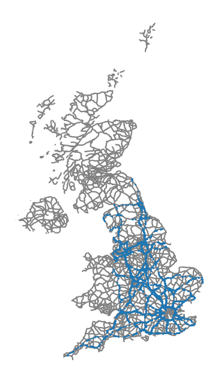
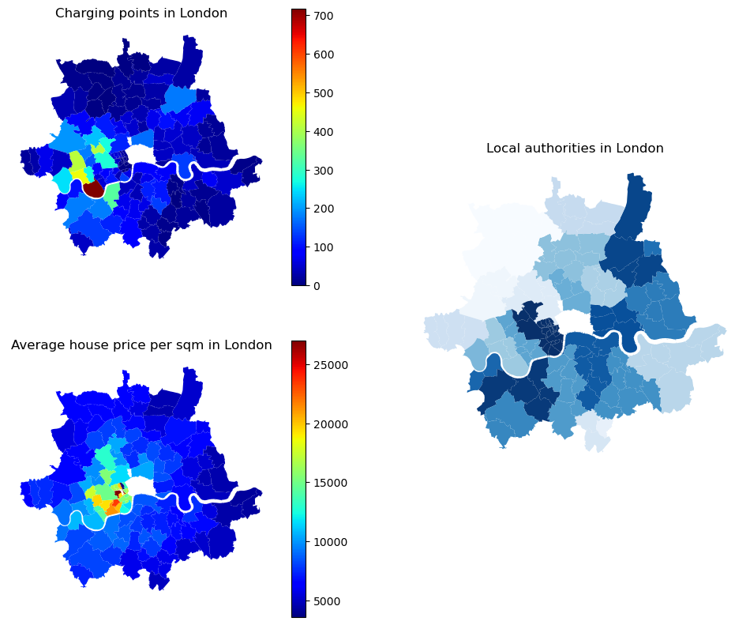

# EV-Charging

From [Zap-map](https://www.zap-map.com/)

This project was completed as part of the General Assembly immersive data science course.

## Table of Contents
[Background](#Background)  
[Goals of the Project](#Goals-of-the-Project)  
[Data Collection](#Data-Collection)  
[Data Cleaning](#Data-Cleaning)  
[Exploratory Data Analysis](#Exploratory-Data-Analysis)  
[Modelling](#Modelling)  
[Limitations](#Limitations)  
[Conclusion](#Conclusion)  
[Future Work](#Future-Work)  
[Libraries Used](#Libraries-Used)  
[Contact](#Contact)

## Background
The demand for electric cars has grown exponentially in recent years, with rising environmental pressure, economic incentives and advancements in battery technology driving the transition away from traditional petrol and diesel engines. In January 2023, one out of every five new cars registered in the UK was either a plug-in hybrid vehicle (PHEV) or battery electric vehicle (BEV), representing a significant increase from the previous year. Despite this surge in the number of electric vehicles on the road, there remains a question as to whether the deployment of supporting charging infrastructure is keeping pace with the demand.

The 2021 Competition and Markets Authority (CMA) report highlights the need for charging infrastructure to increase by at least tenfold by 2030. The report also notes the potential risk of "charging deserts" in certain areas across the UK, which makes it evident that the current infrastructure will not be sufficient in the near future. Given this information, it is important to evaluate the effectiveness of the strategy that has been employed until now in deciding the location of charging points. Through this project I aimed to assess the current placement of charging points and determine whether their installation is aligned with areas of high traffic density, where it can be assumed that demand is at its highest.

## Goals of the Project
The hypothesis of this machine learning project is that areas of high traffic flow will correspond with a higher concentration of electric car charging points. In order to test this hypothesis, my project methodology took the following basic outline:
1. Aggregate charging stations in England by location.
2. Determine a metric of traffic flow around each location.
3. Use regression models to determine the coefficients for the traffic variables and assess their significance in predicting the number of charging points per location.

## Data Collection

The data on charging points was sourced from the National Chargepoint Registry (NCR), a government database providing information on publicly accessible charge points within the UK. I then aggregated the data by outcode - the first half of a postal code e.g. ‘NW1’. To determine the factors, other than traffic, that could impact the distribution of charging points, I gathered additional data regarding each outcode. This included data from the Office for National Statistics (ONS), about the local authorities and the rural/urban classification of each area. As the cost of electric vehicles remains high, I was also interested in exploring whether affluence impacted the distribution of charging points. To investigate this, I calculated the average house price per square metre within each outcode using House Price Paid data and Energy Performance of Buildings data.  
    
The crux of the data collection for this project was sourcing the traffic data. Given the talk of "range anxiety" as a major factor preventing people from adopting electric vehicles, I decided to focus on long-range traffic, specifically along motorways. To do this, I web-scraped download links from Highways England, which provided me with over 120,000 CSV files of time-stamped traffic data for various locations along 153 motorways and A-roads in England. I processed this data to determine the average number of cars per minute at over 9000 locations along these roads and used regex to extract the coordinates in longitude and latitude. Finally, using mapbox API, I determined the closest traffic site to each outcode and used the distance and average number of cars to  find a measure of the traffic flow around the outcode. 

## Data Cleaning
Data cleaning included, but was not limited to:

* Removing missing values.
* Standardising the format of variables, e.g. inconsistencies in how the charge point device owner name was written.
* Deriving additional features of interest from the data, which were not originally present in the dataset.
* Performing a sanity check of charge point outcodes against a validated list. Incorrect outcodes were then derived from the longitude and latitude.

## Exploratory Data Analysis

Initial analysis of the traffic data revealed almost no correlation between the calculated metric of traffic flow and the locations of charging points. This was supported by the findings of the CMA report, which noted the limited number of charging points along motorways relative to demand. Furthermore, the data showed a low proportion of charging points at service stations, which would be the expected location when catering to traffic along major roads.

  

  

Further exploration of other variables through EDA revealed distinct differences between urban and rural areas, as well as between affluent and non-affluent regions. However, the key insight was that the areas with the highest density of charging points corresponded with those governed by councils who received government funding to build EV infrastructure. Although there are multiple factors at play, it appears that public policy has been a key driving force behind the distribution of charging points thus far.

  

 

## Modelling
### Regression Models
The preliminary model I created based on the traffic flow variables confirmed the takeaways from the EDA phase that the initial hypothesis could be rejected. The cross-validation mean score of only 0.026, indicated that the model explained less than 3% of the variance in the dataset. Following this, I tested a range of variables and models to create an optimised regression model.

The best performing model was a random forest regression model that achieved an R2 score of 0.655 on the test dataset. This model incorporated the main local authority, urban/rural classification, house price and the traffic variables as predictor variables. The feature importances indicated that the most impactful variables on predicting charging points were the local authority variables. 

In the linear regression model with ridge regularisation, an R2 score of 0.615 was achieved on the test dataset. The largest coefficients in the best model were associated with local authorities such as Hammersmith and Fulham and Wandsworth, both of which have implemented initiatives to establish EV charging infrastructure. This further emphasises that authorities are key predictors of the target variable and the importance of local government in implementing charging infrastructure. 

### Classification Models
Due to the high skew of the target variable, I also framed the problem as a binary classification task, distinguishing between areas with high and low numbers of charging points. Using the median as a split point, the baseline accuracy for the models was 0.5. Including only the top 3 local authorities and the rural/urban classification as predictor variables, I tested several models including Logistic Regression, K Nearest Neighbours, Decision Tree Classifier, Random Forest Classifier, and Extra Tree Classifier. I performed hyperparameter tuning on the Logistic Regression, Decision Tree, and Random Forest models.

The best model was the tuned logistic regression model with a score of 0.700, a significant improvement on the baseline. The confusion matrix and higher recall score indicated a tendency to favour the prediction of high over low numbers of charging points. Going forward, it may be worthwhile to explore alternative methods for defining "high" versus "low" charging point counts based on natural groupings within the target variable distribution.

## Limitations
There were certain limitations in the methodology of the project, including deriving the metric of traffic flow. Due to the number of requests that can be made to Mapbox API without incurring significant cost, I had to calculate the direct distances (as the crow flies) between each outcode and traffic site, and subsequently only map the driving distances to the 20 closest traffic sites. Additionally, the end calculation only utilised the closest traffic site, which may lead to an incomplete picture of the traffic flow in an area. The project also only considered long-distance traffic, while some areas may experience significant levels of local traffic, on smaller roads.

The methodology used in this project had further limitations. The dataset did not include information on the location of private/home EV charging points, which may have an influence on the amount of funding allocated to public charging points. Also, there were challenges in collecting data aggregated by postcode/outcode, as the last census data was collected in 2011, and some of the data used was based on assumptions that local authorities and urban/rural classification had not significantly changed. Finally, there were issues in matching addresses used to find the average price per sqm of houses when joining price paid and energy rating data, which meant that not all properties within the dataset were utilised. 

## Conclusion
The hypothesis that electric car charging points could be predicted based on surrounding traffic has been rejected. The installation of charging points seems to have been focused on other factors rather than creating them in high traffic areas along motorways and A roads, as evidenced by the low proportion of charging points at service stations. The current number of charging points along motorways is insufficient to meet the increasing demand for electric vehicles, and the literature suggests that their number will need to quadruple.

On the other hand, this EDA identified that local authorities play a significant role in the installation of charging points, particularly those that secured government funding, as they had the highest numbers of charging points across England. This finding was consistent with the machine learning models used, with the regression model based on local authorities explaining 61.5% of the variance in the dataset.

## Future Work
It is possible that the current strategy of funding local governments may favour councils with more resources and finances, leading to disparities in the distribution of electric vehicle charging infrastructure. Therefore, it would be informative to investigate the relationship between local government finances and the availability of charging infrastructure using datasets from the Department for Levelling Up, Housing and Communities. A positive correlation between council wealth and the number of charging points may indicate that financially disadvantaged areas are being underserved. To gain a deeper understanding of the effectiveness of the local government-driven installation of charging points, it would be worthwhile to identify the areas with the greatest need for charging infrastructure with respect to the traffic data, particularly in rural areas where limited access has already been identified as an issue.

To further improve the current work, the following steps should be taken:
* Revisiting the method for calculating the traffic metric to ensure its accuracy and relevance.
* Employing statsmodels to examine whether incorporating additional variables, along with local authorities, could enhance the accuracy and effectiveness of the models.
* Improving address matching between Energy Performance of Buildings data to calculate house price per square metre. 

## Libraries Used
* Pandas
* NumPy
* Selenium
* Beautiful Soup
* Urllib
* Requests
* Re
* Pyproj
* Geopy
* Geopandas
* Shapely
* Folium
* Matplotlib
* Seaborn
* SciKit-Learn

## Contact
If you would like to discuss my work further, please feel free to reach out on [LinkedIn](https://www.linkedin.com/in/flora-scott/).

